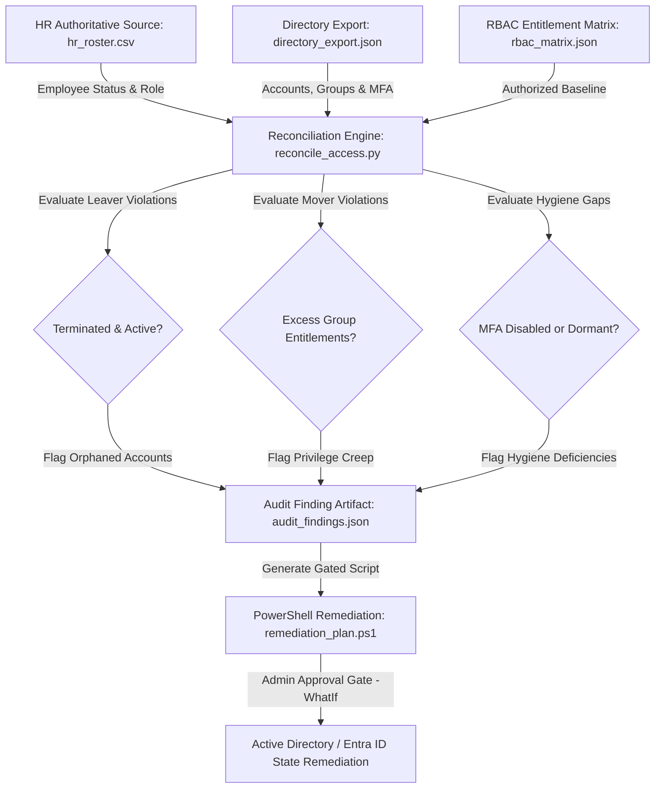

# IAM Access Review & JML Reconciliation Engine

## Overview
An enterprise Identity Governance and Administration (IGA) audit and reconciliation engine. The engine cross-references directory exports (Active Directory / Entra ID) against authoritative HR employee rosters and predefined Role-Based Access Control (RBAC) baseline matrices to detect **orphaned accounts**, **unauthorized privilege creep (Mover gaps)**, **terminated employee access (Leaver gaps)**, and **MFA compliance deficiencies**.



---

## Key Governance & Security Capabilities

* **Joiner-Mover-Leaver (JML) Reconciliation:** Automatically detects terminated workers still possessing active directory accounts (Leaver gap) and role transfers retaining stale permissions from prior departments (Mover gap).
* **RBAC Baseline Drift Analysis:** Identifies privilege creep by comparing current group memberships against authoritithed role entitlements defined in the corporate RBAC matrix.
* **Security Posture & MFA Verification:** Surfaces active accounts missing Multi-Factor Authentication (MFA) and dormant accounts exceeding 90 days of inactivity.
* **Gated, Safe Remediation:** Generates an idempotent, human-in-the-loop PowerShell script (`remediation_plan.ps1`) with built-in `-WhatIf` simulation flags to prevent unintended operational disruption.
* **Compliance Framework Alignment:** Directly satisfies requirements under **NIST CSF v2.0 (PR.AC-01, PR.AC-04, PR.AC-06)**, **CIS Controls v8 (Controls 5 & 6)**, and **SOX / SOC 2 Type II** access certification controls.

---

## Architecture & Tech Stack

* **Core Engine:** Python 3 (Data Normalization, Cross-Source Reconciliation & Drift Analysis)
* **Remediation Layer:** PowerShell Core (ActiveDirectory & Microsoft.Graph modules)
* **Data Formats:** JSON (Hierarchical Audit Artifacts & Entitlement Matrices), CSV (HR Data)
* **Supported Identity Providers:** Active Directory Domain Services (AD DS), Microsoft Entra ID, Generic LDAP

---

## Directory & File Structure

```text
|-- README.md                      # Comprehensive project documentation
|-- reconcile_access.py            # Primary reconciliation & audit engine
|-- data/
|   |-- hr_roster.csv              # Authoritative HR employee roster
|   |-- directory_export.json      # Directory extract (Accounts, groups, MFA)
|   `-- rbac_matrix.json           # Baseline authorized role-to-group mappings
|-- outputs/
|   |-- audit_findings.json        # Structured JSON audit report for SIEM / GRC
|   `-- remediation_plan.ps1       # Gated PowerShell execution script
`-- LICENSE                        # MIT License
```

---

## Reconciliation Engine (`reconcile_access.py`)

The Python audit engine parses authoritative and directory data to evaluate identity drift:

```python
import csv
import json
from datetime import datetime

def load_data():
    with open("data/hr_roster.csv", mode="r", encoding="utf-8") as f:
        hr_data = {row["employee_id"]: row for row in csv.DictReader(f)}
    
    with open("data/directory_export.json", mode="r", encoding="utf-8") as f:
        directory_data = json.load(f)
        
    with open("data/rbac_matrix.json", mode="r", encoding="utf-8") as f:
        rbac_matrix = json.load(f)
        
    return hr_data, directory_data, rbac_matrix

def reconcile():
    hr_data, directory_data, rbac_matrix = load_data()
    findings = []
    remediation_commands = []

    for account in directory_data:
        emp_id = account.get("employee_id")
        upn = account.get("userPrincipalName")
        current_groups = set(account.get("memberOf", []))
        mfa_enabled = account.get("mfa_enabled", False)
        account_enabled = account.get("account_enabled", True)

        # 1. Leaver / Orphaned Account Check
        if emp_id not in hr_data:
            findings.append({
                "severity": "CRITICAL",
                "type": "ORPHANED_ACCOUNT",
                "upn": upn,
                "detail": "Account exists in directory with no matching HR record"
            })
            remediation_commands.append(f"Disable-ADAccount -Identity '{upn}' # Critical Orphan")
            continue

        hr_record = hr_data[emp_id]
        if hr_record["employment_status"] == "TERMINATED" and account_enabled:
            findings.append({
                "severity": "CRITICAL",
                "type": "TERMINATED_USER_ACTIVE",
                "upn": upn,
                "detail": f"Employee terminated on {hr_record.get('termination_date')} but account is ACTIVE"
            })
            remediation_commands.append(f"Disable-ADAccount -Identity '{upn}' # Terminated Worker")

        # 2. Mover / Privilege Creep Check
        assigned_role = hr_record.get("job_role")
        authorized_groups = set(rbac_matrix.get(assigned_role, []))
        excess_groups = current_groups - authorized_groups

        if excess_groups:
            findings.append({
                "severity": "HIGH",
                "type": "PRIVILEGE_CREEP",
                "upn": upn,
                "job_role": assigned_role,
                "excess_groups": list(excess_groups)
            })
            for grp in excess_groups:
                remediation_commands.append(f"Remove-ADGroupMember -Identity '{grp}' -Members '{upn}' -Confirm:$false")

        # 3. Security Hygiene: MFA Compliance Gap
        if account_enabled and not mfa_enabled:
            findings.append({
                "severity": "MEDIUM",
                "type": "MFA_NON_COMPLIANT",
                "upn": upn,
                "detail": "Active directory account does not have MFA enforced"
            })

    # Export Audit Findings Report
    with open("outputs/audit_findings.json`", "w", encoding="utf-8") as f:
        json.dump({"audit_timestamp": datetime.utcnow().isoformat() + "Z", "total_findings": len(findings), "findings": findings}, f, indent=2)

    # Export Gated Remediation Script
    with open("outputs/remediation_plan.ps1", "w", encoding="utf-8") as f:
        f.write("# Gated IAM Remediation Script - Requires Execution Review\n")
        f.write("[CmdletBindingSupportsShouldProcess)]\nparam()\n\n")
        for cmd in remediation_commands:
            f.write(f"{cmd}\n")

    print(f"Reconciliation complete: {len(findings)} governance findings detected.")

if __name__ == "__main__":
    reconcile()
```

---

## Sample Execution & Audit Output

### Detected Findings Summary Table
| Severity | Violation Type | User Principal Name | Violation Details / Identified Drift |
| :--- | :--- | :--- | :--- |
| `CRITICAL` | `ORPHANED_ACCOUNT` | `temp_contractor99@enterprise.local` | No authoritative HR record linked to active account |
| `CRITICAL` | `TERMINATED_USER_ACTIVE` | `bwayne@enterprise.local` | Employee terminated 2026-07-15; Active account retained |
| `HIGH` | `PRIVILEGE_CREEP` | `jsmith@enterprise.local` | Role: *Billing Specialist*; Retained: *Domain Admins*, *Engineering-Prod* |
| `MEDIUM` | `MFA_NON_COMPLIANT | `tstark@enterprise.local` | Active account missing required MFA registration |

### Generated Audit Artifact (`outputs/audit_findings.json`)
```json
{
  "audit_timestamp": "2026-08-25T17:00:00Z",
  "total_findings": 4,
  "findings": [
    {
      "severity": "CRITICAL",
      "type": "TERMINATED_USER_ACTIVE",
      "upn": "bwayne@enterprise.local",
      "detail": "Employee terminated on 2026-07-15 but account is ACTIVE"
    },
    {
      "severity": "HIGH",
      "type": "PRIVILEGE_CREEP",
      "upn": "jsmith@enterprise.local",
      "job_role": "Billing Specialist",
      "excess_groups": ["Domain Admins", "Engineering-Prod"]
    }
  ]
}
```

---

## Gated PowerShell Remediation (`outputs/remediation_plan.ps1`)

The generated remediation script enforces a safety gate to ensure administrators can simulate changes prior to live execution:

```powershell
# Gated IAM Remediation Script - Generated by IAM Access Review Engine
[CmdletBindingSupportsShouldProcess)]
param(
    [switch]$ExecuteChanges = $false
)

Write-Host "=== IAM Remediation Execution Plan ===" -ForegroundColor Cyan

if (-not $ExecuteChanges) {
    Write-Host "[SIMULATION MODE] Running in WhatIf mode. Use -ExecuteChanges to apply." -ForegroundColor Yellow
    # Simulated Actions
    Disable-ADAccount -Identity 'bwayne@enterprise.local' -WhatIf
    Remove-ADGroupMember -Identity 'Domain Admins' -Members 'jsmith@enterprise.local' -WhatIf
} else {
    Write-Host "[LIVE MODE] Applying approved governance remediations..." -ForegroundColor Red
    Disable-ADAccount -Identity 'bwayne@enterprise.local'
    Remove-ADGroupMember -Identity 'Domain Admins' -Members 'ismith@enterprise.local' -Confirm:$false
}
```

---

## Getting Started

### 1. Prerequisites
* Python 3.8+
* Windows PowerShell 5.1+ or PowerShell 7+ (with ActiveDirectory / Microsoft.Graph modules)

### 2. Execute Access Review Engine
```bash
# Clone the repository
git clone https://github.com/elazarf123/iam-access-review.git
cd iam-access-review

# Run the reconciliation engine
python reconcile_access.py
```

### 3. Review Findings & Execute Remediation
```powershell
# Review findings
Get-Content outputs\audit_findings.json | ConvertFrom-Json

# Run safe simulation
.\outputs\remediation_plan.ps1

# Apply approved remediation
.\outputs\remediation_plan.ps1 -ExecuteChanges
```

