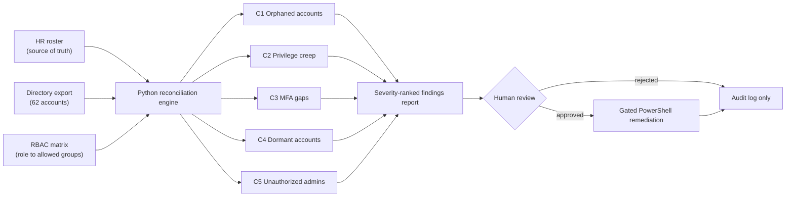

# IAM Access Review: Joiner-Mover-Leaver Audit

**Quarterly user-access review engine — reconciling the directory against HR truth and an RBAC matrix, with gated PowerShell remediation.**

## Overview

Most identity incidents aren't hacks; they're lifecycle failures. A terminated nurse whose account was never disabled. A billing specialist who transferred twice and kept every group along the way. A domain admin without MFA. None of these show up in a vulnerability scan — they show up in an access review, if anyone runs one properly.

This project implements that review end-to-end on a synthetic 62-account healthcare clinic directory with **17 control failures planted across five categories**:

| Check | Finding class | Planted | Found | Severity |
|---|---|---|---|---|
| C1 | Orphaned accounts (terminated, still enabled) | 3 | 3 | CRITICAL |
| C2 | Privilege creep (groups outside RBAC entitlement) | 5 | 5 | HIGH/MED |
| C3 | Privileged users without MFA | 3 | 3 | HIGH |
| C4 | Ownerless service accounts | 2 | 2 | MEDIUM |
| C5 | Dormant accounts (>90 days idle) | 4 | 4 | MEDIUM |

The audit finds **all 17 with zero false positives**, writes a severity-ranked [findings.csv](output/findings.csv) and an analyst [report](output/access_review_report.md) whose root-cause section maps every finding class back to the broken JML stage that produced it — because the fix for orphaned accounts is automating the leaver workflow, not running more reviews.

> All identities are synthetic and reproducible (seeded RNG). No real directory data.

## What makes this an IAM project, not a scripting exercise

**Reconciliation against a source of truth.** The directory is never audited against itself — HR answers "who works here," the RBAC matrix answers "what does each role get," and every finding is a disagreement between the three.

**Remediation with change discipline.** [Disable-OrphanedAccounts.ps1](remediation/Disable-OrphanedAccounts.ps1) consumes the findings, defaults to dry-run, and writes a timestamped audit log per action — identity remediation is itself a production change and gets treated like one.

**Control traceability.** Every check maps to a HIPAA Security Rule citation and NIST CSF 2.0 control in [docs/access_review_procedure.md](docs/access_review_procedure.md), alongside the full JML procedure and the design rationale.

## Architecture



Reconciliation is read-only. Nothing is disabled or de-provisioned without an explicit
human approval step, which mirrors how a real quarterly access review is governed.

## Privacy and security guardrails

- **Synthetic data only.** The 62-account directory, HR roster, and access history are
  generated for this project. No real identities, credentials, or PHI are present.
- **No third-party data egress.** Everything runs locally against local files. Nothing is
  sent to an external API or cloud service.
- **Least privilege by design.** The RBAC matrix defines the minimum group membership per
  role; anything beyond it is flagged as privilege creep rather than silently accepted.
- **Human-in-the-loop remediation.** PowerShell actions are gated behind review and run in
  `-WhatIf` mode by default, so a false positive cannot disable a live account.
- **Auditability.** Every finding carries its check ID, severity, and supporting evidence so
  the result is defensible to an auditor, not just a console message.

## Repository structure

```
iam-access-review/
├── data/                # hr_roster.csv, accounts_export.csv, rbac_matrix.csv
├── src/
│   ├── generate_identity_data.py   # Seeded generator with planted failures
│   └── run_access_review.py        # 5-check reconciliation engine
├── output/              # findings.csv + access_review_report.md
├── remediation/
│   └── Disable-OrphanedAccounts.ps1  # Gated, logged AD remediation
└── docs/access_review_procedure.md   # JML lifecycle + HIPAA/NIST CSF mapping
```

## How to run

```bash
pip install pandas
python src/generate_identity_data.py
python src/run_access_review.py
# remediation (dry run): pwsh remediation/Disable-OrphanedAccounts.ps1
```

## Skills demonstrated

Identity lifecycle management (joiner-mover-leaver) · access certification / entitlement review · RBAC design & drift detection · PowerShell AD automation with audit logging · HIPAA §164.308 & NIST CSF 2.0 PR.AA control mapping · Python (pandas) reconciliation

## About

Built from 4+ years administering AD/M365/Entra identities in enterprise support — this is the review I'd stand up on day one of an IAM analyst role.

📫 elazarferrer1@gmail.com · [Profile](https://github.com/elazarf123)
